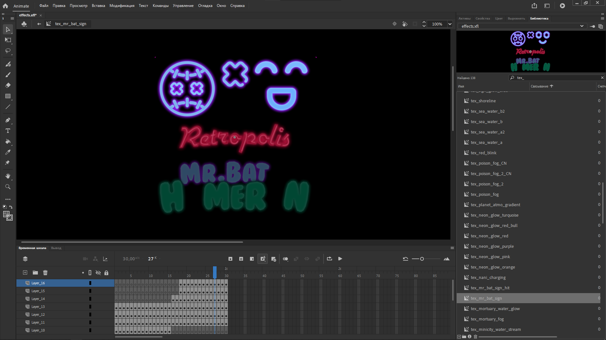
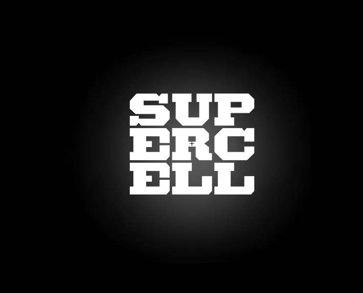
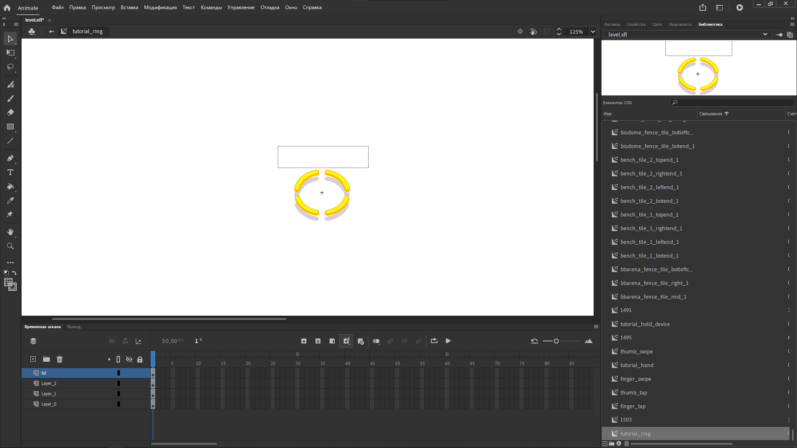
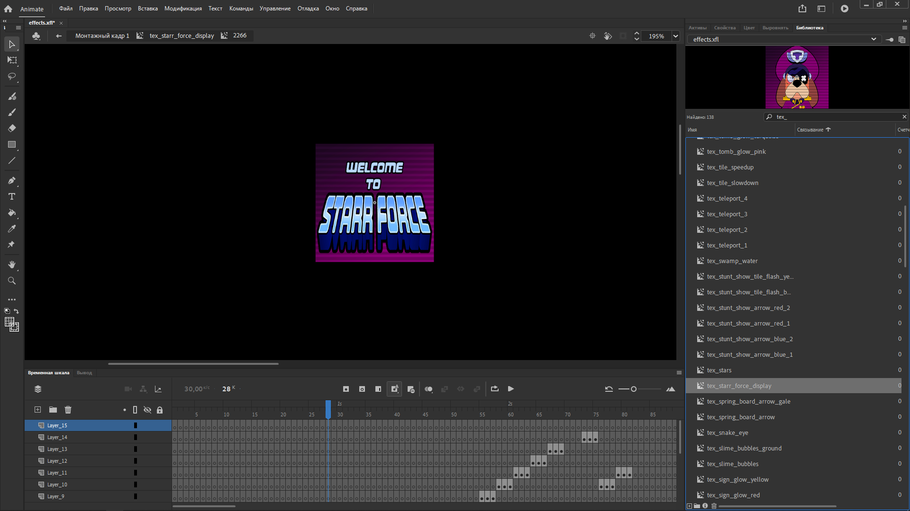

<h1 align="center"> SC </h1>

Supercell SWF (Flash) file format decompiler and compiler. Supercell's games using .sc files for almost all 2D graphics (UI, VFX, particles, facial animations and other).

Please follow the Supercell fan content policy - http://supercell.com/fan-content-policy!

## About

This tool is designed to import and export 2D assets (`*.sc`, `*_dl.sc`, `*_tex.sc` files) from Supercell games using Adobe Animate. At the moment, the tool is very slow when working with large files (so we do not advise you to import large files like ui.sc if you have a weak PC). Maybe we rewrite it on C++ or C# in future...

There are also a lot of bugs and errors in the tool, if you find them, please let us know in `issues`!

## Requirements
- Python 3.9+ (for run the script)
- sc-compression (for file compression/decompression)
- numpy (for optimizing)
- opencv-python (for images stuff)
- Adobe Animate 2022 (for view and edit assets)
- TexturePacker (for saving texture sprite atlases)

## How To Use

Please **watch all the videos below** before using this tool!

### Import
Link here...

### Export
Link here...

## About JSON

Why not? You can convert .sc files to .json and vice versa (Not recommended as it is very difficult to edit. Also .json files can be very large!) So use this at your own risk...

## Screenshots and Video

Some screenshots from Adobe Animate 2022.

<table>
    <tr>
        <td></img></td>
        <td></img></td>
    </tr>
    <tr>
        <td></img></td>
        <td></img></td>
    </tr>
    <tr>
        <td></img></td>
        <td></img></td>
    </tr>
</table>

Animations from Clash Royale and Brawl Stars in Adobe Animate for example.

[8-Bit event](assets/8bit_event.mp4)

## About SC Files

All basic information about the asset is stored in a *.sc file (not *_tex.sc!) It contains shapes (graphic symbols with bitmap instances), text fields (for text input/output, also sometimes used for buttons in UI), movieclips ("animation tables" with shapes, text fields and other movieclips animations)
Main *.sc file uses *_tex.sc to store compiled OpenGL 2D texture atlases (this external texture files are very useful)
Supercell's uses Adobe Animate and TexturePacker to create these assets.
Nothing more to say, I think.

## TODO List
- Find a way to add LUMINANCE_ALPHA textures support (for OpenCV)
- Rewrite it on C++ or C# (because Python is **very** slow)

:)
